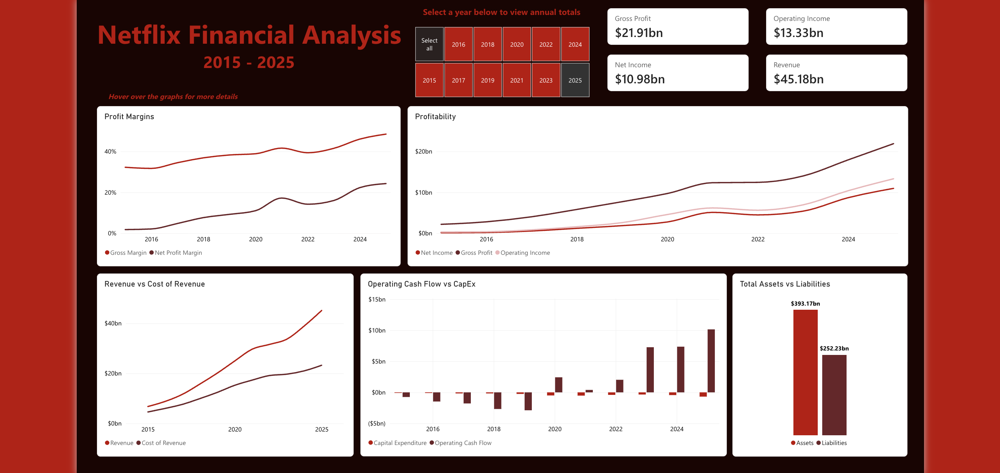
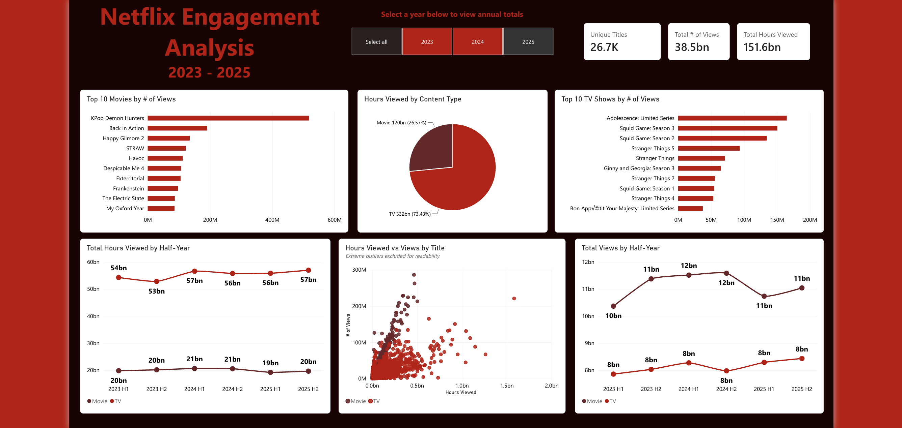
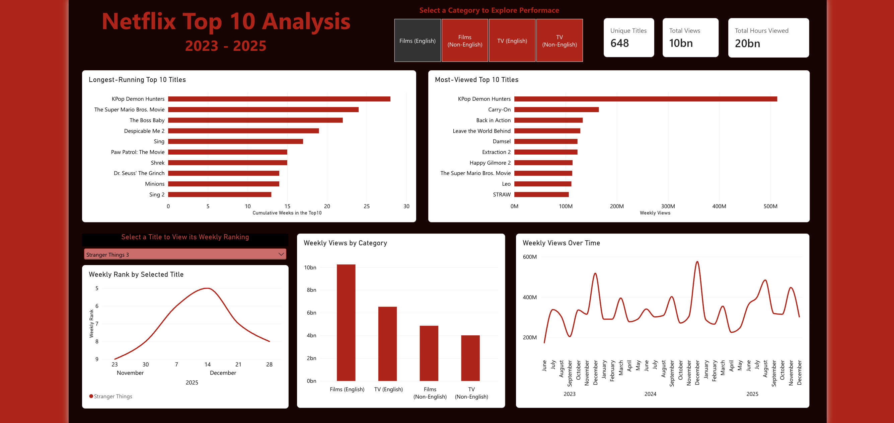

## Project Status

🚧 Work in Progress

# Netflix Data Analysis

## Project Overview
The purpose of this project is to analyze Netflix’s financial performance, viewer engagement, and content performance to develop a better understanding of the company and its trends. Data was first collected and compiled from multiple sources, which are documented below. The data was then cleaned and prepared using Python and pandas. Next, Power BI was used to create interactive dashboards and visualize key trends within each dataset. SQL was then used to further explore and analyze the data. Observations, decisions, and conclusions made throughout the project are documented along the way.

## Tools Used
- Excel
- Python (Pandas)
- SQL
- Power BI

## Data Collection & Sources

The Excel files used for data cleaning can be found here:

- [Final Cleaned Tables](data/Netflix_Analysis_Data.xlsx)
- [Raw Data](data/Netflix_Raw_Data.xlsx)

### Financial Data
Financial data from 2015–2025 was obtained from [Netflix's SEC Filings](https://ir.netflix.net/financials/sec-filings/default.aspx). Netflix's annual 10-K and quarterly 10-Q filings were used to collect the financial data. Some financial fields were no longer reported in later years; where possible, missing values were calculated using other reported figures. Values that could not be reliably calculated were left blank.

The [cleaned excel file](data/Netflix_Analysis_Data.xlsx) contains the financial dataset along with column descriptions, a color key, example screenshots of the source data, and the equations used for calculated values.

### Engagement Data
Engagement data from 2023–2025 was obtained from the [What's on Netflix Engagement Report Search](https://www.whats-on-netflix.com/most-popular/netflix-engagement-report-search/). Half-year reporting periods were used to make changes in engagement over time easier to compare and visualize.

The raw data was cleaned and prepared in Python using pandas. The Python cleaning script is included in this repository. Both the raw and cleaned data are available in the [data folder](data), along with column descriptions, calculations used to create additional fields, and a title reference table for the final combined engagement dataset.

### Top 10 Data
Weekly global Top 10 data was obtained directly from [Netflix's Top 10 dataset](https://www.netflix.com/tudum/top10/data/all-weeks-global.xlsx). The raw dataset was cleaned and prepared in Python using pandas, and the cleaning script is included in this repository.

Both the original raw data and the final cleaned dataset are available in the [data folder](data). Column descriptions for the final dataset are also included for reference.

## Data Cleaning & Preparation
After the data was collected, the raw data was imported into Python for cleaning and preparation. Since the financial dataset was manually collected and organized, it did not require additional cleaning in Python.

The Python notebooks used for data cleaning can be found here:

- [Engagement Data Cleaning Notebook](notebooks/Engagement_data_cleaning.ipynb)
- [Top 10 Data Cleaning Notebook](notebooks/Top10_data_cleaning.ipynb)

### Engagement Data
The engagement data originally consisted of two separate datasets: one reporting hours viewed and another reporting number of views. Both datasets went through the same general cleaning process.

First, the data was reshaped into a more analysis-friendly format, with the reporting period and half-year represented as rows rather than separate columns. Runtime values were then converted from a DD/HH/MM format into total minutes to make them easier to use in calculations and visualizations. Unnecessary characters, such as hyphens used in place of values, were also removed or replaced so the fields could be interpreted correctly by analytical tools.

Title names were then cleaned and standardized. Some titles had been unintentionally translated or altered due to their original data type and formatting, so these values were corrected to maintain consistency between the datasets.

After cleaning the Hours Viewed and Views datasets separately, they were combined to create the final Engagement dataset used for analysis. Both the intermediate cleaned datasets and the final combined dataset are included in the Excel workbook.

### Top 10 Data
The Top 10 dataset required less cleaning because the original data was already well structured. Since this project focuses on 2022–2025, records from 2026 were removed. Data types were also reviewed and adjusted where necessary to ensure the fields could be analyzed correctly.

## Power BI Dashboards

## SQL Analysis

## Key Findings

